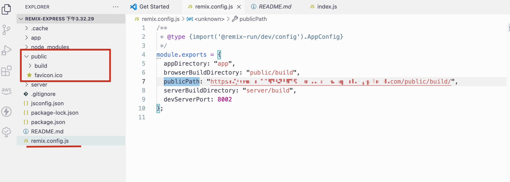

# 使用指南

暂时就这样用吧，考完试再更新

在remix.config.json中指定要部署的public静态文件夹的位置，比如我这里放到了存储桶

```
npm run build
```
生成public文件夹和server文件夹

将public文件夹放到存储桶中

创建阿里云http函数

将server文件夹中的build上传到阿里云函数中(选择nodejs14)

修改云函数的默认index.js为这样

```js
const {
  createRequestHandler
} = require("./remix-aliyunhttp");
exports.handler = createRequestHandler({
  build: require("./build")
});
```
```
安装依赖
npm install remix-aliyunhttp
```
阿里云函数的目录结构像这样
```
---build
---node_modules
---package.json
---index.js
```


